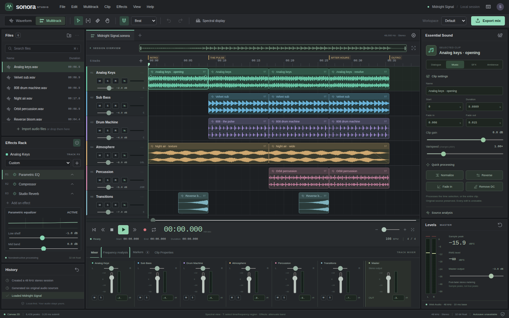

# Sonora Studio

**Audio, in its element.** An independent, local-first browser audio workstation with an Audition-inspired editing workflow, original branding, real audio processing, and an actual WebGPU waveform backend.

Built in plain HTML, CSS, and JavaScript. No React, framework runtime, CDN, external fonts, third-party audio library, or installation step is required to run the application.

[**Open Sonora Studio**](https://wieslawsoltes.github.io/SonoraStudio/) · [Deployment workflow](https://github.com/wieslawsoltes/SonoraStudio/actions/workflows/pages.yml)



## Run

Use Node.js 20 or newer; verification used Node.js 22.16.0.

```sh
git clone https://github.com/wieslawsoltes/SonoraStudio.git
cd SonoraStudio
npm start
```

Open `http://localhost:5173`. The server binds to loopback by default. `PORT=8080 npm start` changes the port; `HOST` can override the bind address. Use HTTPS when hosting remotely. A LAN HTTP address is not a substitute for a secure origin.

There is deliberately no `npm install` step. All runtime and build code is included.

### Single-file edition

`dist/sonora-studio.html` embeds the application, styles, SVG icon, DSP worker, and recording worklet. Open it directly for a quick trial; browser permissions and file-origin restrictions can limit capabilities. Serving it from localhost or HTTPS is the recommended way to enable WebGPU, microphone capture, and browser persistence.

```sh
npm run build
```

The build is dependency-free. To publish a static site, deploy `dist/sonora-studio.html` as `index.html`. No backend, credentials, or build-time secrets are required. Hosting must permit the inline application script and Blob workers; the default app does not install a service worker.

## First session

The initial session, **Midnight Signal**, is synthesized locally: six stereo source assets, six tracks, sixteen clips, four markers, 108 BPM, and a roughly 36-second arrangement. The waveforms and spectrum come from the actual generated samples.

Press **Space** to play. Drag a clip to move it, drag its edges to trim it, and drag its top diamonds to change fades. Double-click a clip to open the waveform editor. Use **T** to select time, enable **Spectral display**, and drag in the lower pane to select time and frequency. **Effects → Spectral attenuation** processes that region. **Export mix** renders a WAV through the actual effects graph.

Use headphones and a moderate system volume when experimenting with gain or imported material. The output meter is a sample-peak meter, not a protection limiter.

## Implemented capabilities

| Area | Implemented behavior |
| --- | --- |
| Multitrack editing | Cross-track and multiselect movement, rate-aware left/right trims, splitting, copy/cut/paste, duplicate, delete, per-track ripple delete, overlapping-clip crossfades, clip locking, numeric properties, snapping and markers. |
| Waveform editing | Stereo waveform editor, selection-based operations, trim/delete range, source-domain processing, zoom and pan. Sources are replaced by new immutable assets, preserving undo. |
| Playback | Audio-clock transport, pause/stop/seek, lookahead looping, clip gain/fades/varispeed, track pan, gain, mute/solo, master gain, gain automation. |
| Effects | Three-band parametric EQ, dynamics compressor, convolution reverb, filtered feedback delay, high-pass and low-pass filters, waveshaper saturation, presets and per-effect bypass. |
| Source processing | Peak normalization, RMS matching with peak headroom protection, amplification, reverse, fade-in/out, silence, DC removal, amplitude gate, time/frequency spectral attenuation. |
| Analysis | Real source statistics, multiresolution peak caches, FFT frequency analysis, logarithmic spectrogram, live stereo sample-peak and RMS meters, track meters. |
| Export | Actual offline mixdown of a session, selected clip with effects, or selected time range; mono/stereo; 44.1/48/88.2/96 kHz; 16/24-bit PCM or 32-bit float WAV; optional normalization, TPDF dither and two-second effects tail. |
| Import | Native PCM/float WAV decoder; other audio files supported by the browser's decoder. Drag/drop and file input. Native WAV import preserves source sample rate. |
| Projects | Portable `.sonora` JSON with lossless float-WAV audio for all referenced sources; transactional undo/redo; IndexedDB autosave/restore with visible failure handling. |
| Recording | Microphone PCM capture through a dedicated AudioWorklet, timeline-aligned start, mono-to-stereo mirroring, chunk transfer, and explicit flush. Requires microphone permission. No input monitoring. |
| Interface | Files, effects rack, history, multitrack/waveform editors, overview, transport, mixer, frequency analysis, marker list, clip properties, Essential Sound-style inspector, keyboard commands, and compact layout. |

Sound-role buttons assign track metadata; they are not an automatic speech classification or mastering service.

## Rendering and audio separation

`src/renderer.js` contains a real WGSL pipeline. The visible waveform is submitted as six-vertex rectangle instances, using a reusable GPU buffer and one draw call per waveform redraw. Min/max peak pyramids select the appropriate detail level for the current zoom. Only visible clips and rows contribute geometry. The playhead is a separate DOM overlay; playback does not rebuild the full waveform each frame.

Web Audio, not the graphics GPU, performs playback, mixing, effects, and offline rendering. Worker-thread JavaScript performs source analysis and spectral processing. The spectrogram is drawn from computed pixels with Canvas 2D; it is not a GPU FFT implementation.

The status bar reports the selected backend honestly: **WebGPU** only after successful adapter/pipeline initialization, otherwise **Canvas 2D**. Its timing measures CPU submission work, not GPU execution time. Multitrack waveform display is peak-normalized per source for readability; this does not alter audio gain. The waveform editor uses the source amplitude scale.

## Keyboard essentials

| Shortcut | Action |
| --- | --- |
| Space / Escape | Play or pause / stop or clear selection |
| V / T / R / H | Move / range / razor / hand |
| Ctrl or Command + K / D | Split / duplicate |
| Ctrl or Command + C / X / V | Copy / cut / paste clips |
| Ctrl or Command + Z / Shift + Z | Undo / redo |
| Delete / Shift + Delete | Delete / ripple delete |
| Ctrl or Command + I / S / E | Import / save project / export mix |
| Shift + R | Start/stop microphone recording |
| M / L / S | Marker / loop / snap |
| + / − / F | Zoom in / zoom out / fit |
| Shift while dragging | Temporarily bypass snapping |
| Ctrl or Command + click | Toggle clip multiselection |
| Alt-click / right-click an automation point | Add / remove a gain point |
| ? | Full shortcut reference |

## Validation

```sh
npm test
npm run build
# Optional browser-test tools; not application dependencies:
python -m pip install playwright
python -m playwright install chromium
npm run test:browser
```

The delivered build passed **42 core tests and 20 Chromium integration tests**, with no uncaught browser JavaScript errors. The browser suite verified real playback, loop timing, PCM-derived meters, pointer edits, effects, offline audio rendering, seek-consistent gain automation, a downloaded 24-bit WAV, region DSP, spectrogram generation, lossless portable projects, file import, and responsive layout.

**Not verified here:** WebGPU adapter/driver execution, microphone device capture, and IndexedDB transactions. The available browser harness permitted an in-memory document but blocked normal navigation and capture; the in-memory document has no secure origin or IndexedDB access. It exercised the Canvas fallback. Recording-worklet algorithms have separate core tests, but these are not a microphone hardware test.

See [TESTING.md](TESTING.md) and the included reports for exact test evidence and additional checks to run on your machine.

## Scope and limits

This is an implemented independent workstation, not Adobe Audition, Adobe code, or complete Audition feature parity. The familiar panel organization is intentional; the name, icons, styles, and generated demo are original.

Not included: VST/AU plug-in hosting, Audition SESX interchange, video workflows, AAF/OMF, surround/bus/send routing, MIDI sequencing, pitch-preserving time stretch, MP3/AAC encoding, automatic noise-print restoration, spectral healing, certified BS.1770 LUFS or true-peak analysis, RF64/BWF metadata, calibrated input/output latency compensation, cloud collaboration, or streamed long-session storage.

Varispeed changes both duration and pitch. RMS matching is not LUFS normalization. The gate is amplitude-based, not adaptive denoising. Effects start with fresh state at seeks and offline range boundaries; no pre-roll reconstructs prior delay/reverb state. Stereo is the mixing/output architecture. A single armed track records the microphone; this is not a multichannel interface recorder.

The model caps a session at 128 tracks, 10,000 clips, 16 effects per track, and a four-hour timeline. File/decoded-import and offline-output guardrails are 512 MiB, not a guarantee that a browser can safely use that much memory. Audio remains decoded in RAM. Undo versions and analyses add overhead. Projects serialize only referenced sources and do not retain undo history. Keep portable backups; browser storage can be cleared or evicted.

## Source map

See [ARCHITECTURE.md](ARCHITECTURE.md) for graph routing, source-time mapping, FFT processing, GPU layout, project format, threading, and extension points.

License: MIT. No Adobe assets, proprietary recordings, or bundled font files are included.
